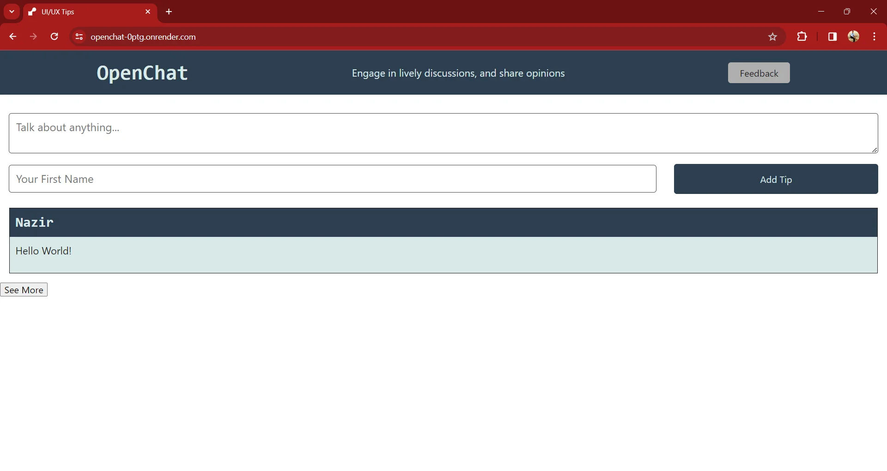

# OpenChat

### Description
Welcome to OpenChat, a simple yet powerful chat application where anyone can come and chat freely. OpenChat is built using the MERN (MongoDB, Express.js, React.js, Node.js) stack, ensuring a robust and scalable architecture.

## Technologies Used
- HTML
- CSS
- JavaScript
- React
- GraphQL
- MongoDB
- Node.js
- Mongoose (ODM)
- Apollo
- Express

Deployed Site: https://openchat-0ptg.onrender.com/

GitHub Repo: https://github.com/Batking74/OpenChat